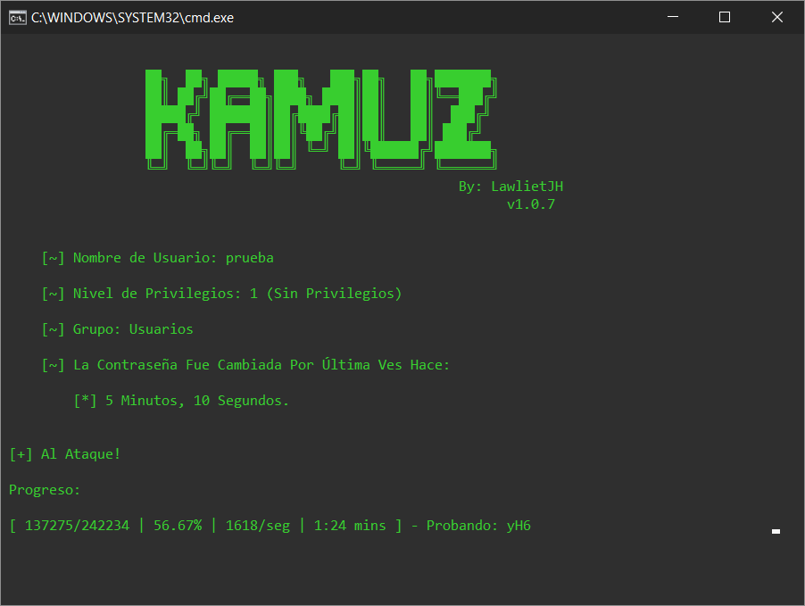

# Kamuz
## Obten Contraseñas de Cualquier Usuario de Windows Mediante Ataques de Fuerza Bruta Veloz y con Interfaz Gráfica.
### Versión Actual: v1.1.0 (Con Interfaz Gráfica)
- - -
### Python: 3 
### OS: Windows
- - -
### Dependencias: PyWin32 y PyQT5.

  * __Se Debe Instalar Desde Una Terminal (CMD) Con el Comando: _python -m pip install -r requirements.txt___
  * __Esto con la finalidad de instalar las versiónes de los módulos usadas durante el desarrollo.__

### Probado en Python 3.8.8

### Muestra de Ejecución para interfaz gráfica (Código actual):

### Muestra de Ejecución para código en consola (Rama 'base'):

Código solo para terminal: [Kamuz para Temrinal](https://github.com/LawlietJH/Kamuz/tree/base "Kamuz base, código base para consola.")

